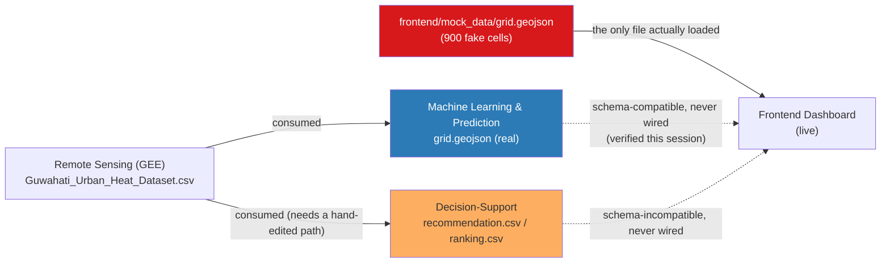

# Cross-Module Integration Audit — Urban Heat Island Mitigation Simulation

**Audited:** 2026-08-13
**Repo:** `ankamteja/urban-heat-island-mitigation-simulation`
**Scope:** not "does each module work" (each module already self-audits that — see their own `SPEC_AUDIT.md`/`README.md`) but *"does the project work as one system, and what's actually missing to make it one."*

Verified by running the Remote Sensing GEE script's source, the ML pipeline (fresh re-run, byte-identical output), the Decision-Support script (read + traced by hand, since it can't currently run — see Finding 4), and the live frontend in a browser with real pipeline output loaded.

**Bottom line:** four modules, four different people, four things that each individually work and are honestly documented. They were never integrated with each other. The dashboard still shows mock data. Two of the four modules independently built a "recommend an intervention" engine, and they disagree with each other by up to 67x on cost. None of that is visible unless you read all four modules side by side — which is what this document does.

---

## 1. Module status at a glance

| Module | Branch(es) | Runs from a fresh clone? | Self-documented quality | Wired to anything downstream? |
|---|---|---|---|---|
| Remote Sensing & Data Engineering | `chore/restructure-remote-sensing` | N/A (GEE script, runs in Earth Engine, not locally) | High — detailed `SPEC_AUDIT.md`, 8/16 spec items met | Feeds the other 3 modules via `Dataset/Guwahati_Urban_Heat_Dataset.csv` |
| Machine Learning & Prediction | *(this session, pending push)* | **Yes** — verified byte-identical re-run this session | High — `README.md` + `SPEC_AUDIT.md`, states its own R² honestly | Exports `grid.geojson` in the exact schema the frontend wants — **but nothing points the frontend at it** |
| Decision-Support | `feature/decision-support` | **No** — hardcoded path `/mnt/user-data/uploads/...` doesn't exist in this repo or on this machine (verified) | High — `README.md` doubles as a spec audit | Outputs `recommendation.csv`/`ranking.csv` in a schema the frontend does not understand (see Finding 2) |
| Frontend Dashboard | `frontend-dashboard` (merged twice — basic map, then split-screen compare view) | Yes | Medium — `README.md` explicitly documents the data contract and anticipates exactly the integration problem below, in a "Swapping in real data" section that was never acted on | Reads only `mock_data/grid.geojson`, hand-written by `generate_mock.py`, 900 fake cells |

Every module works in isolation. **None of them talk to each other.** That's the finding this document exists to make visible.

---

## 2. Integration matrix — what feeds what, and what's actually connected



Solid arrows are real, verified data flow. Dashed arrows are what *should* happen and currently doesn't.

---

## 3. Findings

### Finding 1 — The dashboard has never displayed real data

`frontend/js/main.js` line 1 is still:

```js
loadGrid('mock_data/grid.geojson')
```

`mock_data/grid.geojson` is synthetic (`generate_mock.py`, 900 cells, temperature range ~28–42°C). The real Remote Sensing dataset has 8,144 cells spanning 20.9–33.1°C. Nobody has ever seen this dashboard render a real Guwahati number.

The frontend's own `README.md` anticipated this exact situation:

> Replace `mock_data/grid.geojson` with the real pipeline output, keeping the exact field names above... If `predictions.csv` / `recommendation.csv` are separate files from Members 2/3, join them on `grid_id` into a single GeoJSON before dropping it in here — **the frontend expects one merged file, not three.**

That instruction was written, and never followed. This session verified (loaded the real ML `grid.geojson` into a live copy of the dashboard in a browser) that doing so for the ML module's output works correctly today with **zero code changes** — all 8,144 cells render, filters work, popups show real values. It is a one-line edit that has simply never been made.

**Why this wasn't done as part of this session:** the ML module's own guardrail is "no silent frontend data swap" — deliberately, so the switch is a visible, reviewable diff a human signs off on, not something that happens quietly inside an unrelated commit. That guardrail is still the right call. It just means someone still has to make the swap.

### Finding 2 — Two modules independently built a recommendation engine, and their outputs cannot be merged as-is

Both **Machine Learning & Prediction** (`tier_and_recommend.py`) and **Decision-Support** (`member3_decision_support.py`) take the same input (`Guwahati_Urban_Heat_Dataset.csv`) and independently produce "what intervention should this cell get, and what does it cost." Nobody appears to have coordinated on this — the two outputs use different column names, different action vocabularies, and (see Finding 3) wildly different cost assumptions.

| | ML `tiered.csv` | Decision-Support `recommendation.csv` |
|---|---|---|
| Temperature column | `LST` → renamed `temperature` | `LST` → renamed `predicted_temp` |
| Action column | `recommended_action`: `Tree cover` / `Cool roof` / `Green park` / `None` | `intervention`: `trees` / `cool_roof` / `pocket_park` / `green_roof` |
| Cost column | `cost_estimate` (int, INR) | `cost_rupees` (INR) |
| Priority concept | `priority` tier: `High`/`Medium`/`Low` (quantile bins on `Heat_Risk`) | `rank` (continuous, 1..6108) + `within_budget` (bool, ₹50L cap) — no tier concept at all |
| "No action" cells | Kept in the same file with `recommended_action = None` | Dropped to a separate `excluded.csv` |
| Geometry | Polygon per cell (`geo_json`, reused from source) | **None** — only point `lat`/`lon`, not a polygon; would need to be re-joined to source geometry to become a valid `grid.geojson` at all |

The frontend's data contract (`frontend/README.md`) matches the ML module's schema exactly (verified). It matches **none** of Decision-Support's column names, and Decision-Support doesn't even carry the polygon geometry a `grid.geojson` needs. Whoever wires this up has to pick one, or write a merge step that doesn't exist yet.

### Finding 3 — The two modules' cost assumptions for the same intervention diverge by 18–67x

This is the sharpest concrete inconsistency in the repo. Same intervention name (conceptually), same cell size (~8,916 m²), same source data — very different numbers.

| Intervention | ML: `cost_estimate` per cell | Decision-Support: `cost_rupees` per cell | Ratio |
|---|---|---|---|
| Trees | ₹334,350 (150 INR/m² × 25% coverage of an 8,916 m² cell) | ₹5,000 (flat) | **66.9x** |
| Cool roof | ₹534,960 (400 INR/m² × 15% coverage) | ₹30,000 (flat) | **17.8x** |
| Green park / pocket park | ₹222,900 (250 INR/m² × 10% coverage) | ₹400,000 (flat) — but disabled under proxy land cover, so never actually output | 0.56x (inverted — Decision-Support's *would be* higher here) |

ML derives cost from cell area × a per-m² rate × a coverage fraction (physically motivated: you can't plant trees over 100% of a cell). Decision-Support uses flat per-cell placeholders, explicitly labeled "placeholder engineering estimates for a hackathon demo." **Neither is wrong on its own terms** — both modules say so themselves — but if both numbers ever end up in the same pitch deck or dashboard, they contradict each other by an order of magnitude for literally the same word ("trees").

### Finding 4 — Decision-Support cannot be reproduced from a clean clone

```python
DATASET_CSV = "/mnt/user-data/uploads/Guwahati_Urban_Heat_Dataset.csv"
```

That path doesn't exist in this repository and doesn't exist on this machine (verified). It looks like a sandbox upload path from whatever environment the script was originally run in. The committed `recommendation.csv`/`ranking.csv`/`excluded.csv` (6,108 / 6,109 / 2,037 rows) are almost certainly real — their row counts line up exactly with the real 8,144-row dataset — but nobody can currently re-run this script by cloning the repo and following its own instructions. Contrast with the ML module, which this session verified re-runs byte-identical from a clean pipeline call.

### Finding 5 — Under the current data, Decision-Support only ever recommends one intervention

Not previously documented anywhere, including Decision-Support's own audit. Traced by hand and confirmed against the committed output:

```
awk -F',' 'NR>1{c[$6]++} END{for(k in c) print k, c[k]}' recommendation.csv
trees 6108
```

**100% of the 6,108 recommended cells get `trees`. `cool_roof` — despite being "enabled" for the exact same proxy land-cover classes as `trees` — never wins, in any row.**

Why: `cooling_per_rupee = cooling_c / cost_per_cell`. Trees: `0.8 / 5,000 = 1.6e-4`. Cool roof: `1.0 / 30,000 = 3.3e-5`. Trees beats cool roof by ~4.8x on every cell where both are legal, and under the NDVI-quantile proxy land cover, both are *always* legal together (`moderate`, `bare_or_built_hot`) — cool roof's one exclusive land-cover class, `building_dense`, is a category the proxy classifier can never produce (it only ever outputs `vegetated` / `moderate` / `bare_or_built_hot`). So `cool_roof`, `pocket_park`, and `green_roof` are all mathematically unreachable right now — only `pocket_park` and `green_roof` were flagged as intentionally disabled; `cool_roof`'s dead-code status is a side effect nobody called out.

This isn't a bug exactly (the logic does what it says), but it means "4 intervention types" in the pitch is currently "1 intervention type" in the actual output.

### Finding 6 — The single highest-leverage fix is still upstream, unfixed, and it explains most of the above

Verified still present in `GEE/urban_heat_analysis.js` today:

```js
var ndvi = image.normalizedDifference(['SR_B5','SR_B4']).rename('NDVI');
```

Still computed on raw DN values, missing the Landsat C2 L2 rescale (`× 0.0000275 − 0.2`) that the Remote Sensing module's own `SPEC_AUDIT.md` flagged back on 2026‑08‑07, with a drop-in fix already written (`Fix A`). This one unfixed line is the root cause of:

- ML module's compressed NDVI (max 0.386, should reach ~0.8) and biased-high `Heat_Risk` → less reliable priority tiers
- ML model's weak NDVI signal (correlation with LST only −0.279) — likely artificially weak because of this same bias
- **Both** Decision-Support's and ML's proxy land-cover classifiers, which exist *only* because there's no real `land_cover` column — which itself is one GEE re-run away (`SPEC_AUDIT` item D, snippet already written) once someone re-runs the script
- Decision-Support's `NEVER_TOUCH` road/water/highway exclusion rule being numerically inactive (0 cells excluded on that basis — the proxy can't distinguish a road from bare soil)

Three separate downstream modules built workarounds for the same one missing feature. Fixing it once upstream removes all three workarounds at once.

### Finding 7 — The one real number both modules compute (per-cell cooling amount) never reaches the UI

`compareView.js`'s "after intervention" map applies a flat `-3°C` to *any* cell with a non-`None` `recommended_action`, regardless of which intervention or its actual `cooling_c` (ML computes 0.8/1.0/1.5/2.0°C per intervention type; Decision-Support computes the same). The frontend's own `README.md` calls this out as a known limitation of the mock-data phase ("this should be replaced by Member 2/3's real predicted cooling values once available") — it's the most-requested follow-up on the frontend side and the only piece of downstream work with zero ambiguity about what to do.

---

## 4. Prioritized punch list — what's actually missing to make this one system

1. **Fix the GEE NDVI rescale + join land cover/NDBI, re-export.** (Finding 6.) One change, upstream, removes the proxy-land-cover workaround in two modules and un-biases every downstream number. Already has a drop-in fix written in the Remote Sensing `SPEC_AUDIT.md`.
2. **Pick one recommendation engine, or explicitly merge the two.** (Findings 2–3.) At minimum, reconcile the cost model — a 67x disagreement on "cost of planting trees" is the kind of thing a judge or stakeholder will catch immediately. If both are kept, prefix each with which module produced it; don't let both quietly claim to be "the" cost estimate.
3. **Wire the frontend to real data.** (Finding 1.) Concretely, for the ML module's output (verified compatible today, zero code changes): change `frontend/js/main.js:1` from `loadGrid('mock_data/grid.geojson')` to point at the real `grid.geojson`, or copy the file into `mock_data/`. This is genuinely a five-minute change once someone decides it's ready to be visible.
4. **Fix Decision-Support's hardcoded input path** so `python member3_decision_support.py` works from a clean clone, the same way the ML pipeline does. Trivial fix, currently blocks anyone from verifying or re-running that module's numbers.
5. **Feed real per-cell `cooling_c` into `compareView.js`** instead of the flat -3°C. (Finding 7.) Needs the `grid.geojson` to carry a cooling amount, not just the action label — a small schema addition to whichever pipeline wins step 2.
6. **Retune the frontend legend** for the real LST range (~21–33°C, not the mock's 28–42°C) — already flagged in the ML module's own `SPEC_AUDIT.md`, not yet acted on. Cosmetic relative to 1–5, but it's the first thing anyone will notice once step 3 happens: under the current 30/34/38°C buckets, 98.6% of real cells collapse into one color.

Items 1–2 are the ones that actually require a decision from the team, not just an edit. Items 3–6 are mechanical once 1–2 are settled.

---

## 5. What's *not* a finding

To be fair to the team: every one of the four modules is honestly and thoroughly self-documented, including their own limitations — that's unusual and worth preserving as a norm, not something this audit is correcting. The `SPEC_AUDIT.md`/`README.md` pattern each module independently adopted made this cross-module audit possible in a single session instead of requiring a full code read. Keep doing that.

The Remote Sensing module's own gaps (missing NDBI, missing land cover, missing lat/lon-as-columns, unexported `.tif`/`.geojson` deliverables) are already fully tracked in its own `SPEC_AUDIT.md` and aren't repeated here except where they explain a downstream finding (6).
