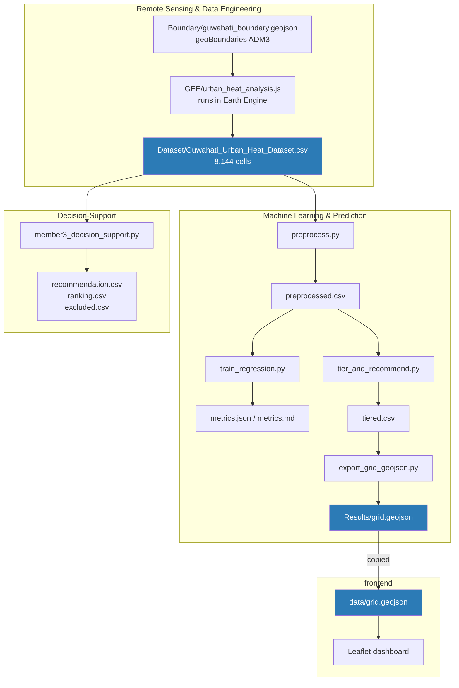

# 1. Architecture

## The shape of the project

Four modules, built by four people, each owning one stage of a linear pipeline. The unit of analysis throughout is a **grid cell**: a ~100 m × 100 m patch of Guwahati. Every module either produces facts about cells or turns facts about cells into decisions about cells.

There are 8,144 of them.

Blue boxes are the three artefacts that cross a module boundary. Everything else is internal to one module.

## What each module owns

### Remote Sensing & Data Engineering

**Owns:** the definition of a grid cell, and every physical measurement attached to it.

Runs entirely inside Google Earth Engine — there is no Python here and nothing to install. `urban_heat_analysis.js` is pasted into the [Earth Engine Code Editor](https://code.earthengine.google.com/), where it filters a year of Landsat 8 Collection 2 Level 2 scenes over the city boundary, masks cloud and shadow, medians them into one composite, derives Land Surface Temperature and vegetation/built-up indices, vectorises a 100 m grid over the boundary, reduces each band into each cell, and exports the result.

Its output — `Guwahati_Urban_Heat_Dataset.csv` — is the single source of truth for the rest of the project. Both downstream modules read it independently.

**Boundary of responsibility:** it produces measurements, not judgements. It says a cell is 29.4 °C; it does not say that is bad.

### Machine Learning & Prediction

**Owns:** turning measurements into ranked, costed guidance, and producing the file the dashboard renders.

Four scripts, run in order:

| Script | Does |
|---|---|
| `preprocess.py` | Parses the embedded `.geo` polygons, derives per-cell centroid Latitude/Longitude, recomputes and validates `Heat_Risk`, writes a tidy table |
| `train_regression.py` | Fits LST regressions (linear + random forest) under both random and spatial-block splits, reports honest metrics for each |
| `tier_and_recommend.py` | Rule engine: quantile priority tiers, a vegetation split, an action table, cost and cooling estimates |
| `export_grid_geojson.py` | Emits `grid.geojson` in exactly the property schema the dashboard reads, with a hard validation gate |

The regression is deliberately *not* what drives the dashboard. There is no ground-truth label for "priority" or "recommended action" anywhere in this project, so inventing a supervised classifier for them would be dressing a rule engine up as a model. The tiering is an explicit, auditable rule engine; the regression exists separately, to characterise how well LST can be predicted from position and vegetation at all.

**Boundary of responsibility:** it decides what should happen to each cell and what that would cost. It does not decide what the city can afford.

### Decision-Support

**Owns:** budget-constrained prioritisation — a different question from tiering.

`member3_decision_support.py` reads the same source CSV, applies hard suitability rules per intervention type (nothing on a road, nothing on water), scores each cell's best option by **cooling per rupee**, sorts descending, walks down the list accumulating cost, and cuts at the budget in `shared/constants.json` — currently ₹10 crore, which funds 299 of 4,157 actionable cells.

It is intentionally not an optimiser. No knapsack DP, no genetic algorithm — a greedy ratio sort is explainable to a stakeholder in one sentence, and that was judged worth more than the few percent a real optimiser would recover.

**Relationship to ML:** the two modules used to overlap badly. Both independently answered "what intervention should this cell get", from separate copies of the same constants — and only one of them applied a land-cover suitability filter. The one that did not was the one feeding the dashboard.

Both now call a single shared rule (`shared/uhi_shared.py`), so **their per-cell actions are identical by construction** and a test asserts it. The division of labour is clean: the ML module owns geometry and the dashboard contract; Decision-Support owns the budget question. See [05 — Decision-Support](./05-decision-support.md).

### frontend

**Owns:** everything a non-technical viewer sees.

A dependency-free Leaflet page — no bundler, no framework, no build step. Six scripts loaded in order by `index.html`, sharing one global scope. It reads exactly one file and renders two synced maps side by side: current temperature, and temperature after each cell's recommended intervention is applied.

**Boundary of responsibility:** it displays; it computes nothing except the after-intervention subtraction.

## The three contracts

Integration in this project is three files and their schemas. Get these right and the modules are interchangeable; get them wrong and nothing composes.

| Contract | Producer | Consumers | Enforced by |
|---|---|---|---|
| `Guwahati_Urban_Heat_Dataset.csv` | GEE script's `Export.table.toDrive` | `preprocess.py`, `member3_decision_support.py` | `load_source()` in `preprocess.py` raises on missing columns |
| `tiered.csv` | `tier_and_recommend.py` | `export_grid_geojson.py` | file-exists check only |
| `grid.geojson` | `export_grid_geojson.py` | `frontend/js/*` | `validate()` — hard-fails on any property key-set mismatch, non-Polygon geometry, or wrong scalar type |

Column-by-column detail: [`07-data-contracts.md`](./07-data-contracts.md).

The `validate()` gate is the only automated integration test in the project. It exists because the frontend calls `.toLocaleString()` on `cost_estimate` and subtracts `cooling_c` from `temperature` — a string in either field fails silently in the browser rather than loudly in the pipeline.

## Where the seams are

Two structural facts worth knowing before you change anything:

**The dashboard is fed by a copy, not a link.** `export_grid_geojson.py` writes into the ML module's `Results/`; the file is then copied to `frontend/data/grid.geojson`. A relative `fetch()` reaching across `../Machine Learning & Prediction/Results/` would work in principle, but that path contains both a space and an ampersand and is fragile to URL-encode from a browser. The copy is deliberate. It also means **regenerating `grid.geojson` does not update the dashboard until you copy it across** — see [`02-setup-and-build.md`](./02-setup-and-build.md).

**The upstream fix that has not been applied to the data.** The Earth Engine script now contains the correct surface-reflectance rescale, cloud masking, land cover and NDBI. The committed CSV predates all of that. Every NDVI-derived number currently in the repo — `Heat_Risk`, priority tiers, the vegetation split, both modules' proxy land-cover classifiers — is computed from uncorrected NDVI. Re-running the script in Earth Engine regenerates everything correctly; nobody has done that yet. This is the single largest known limitation and it is detailed in [`08-limitations.md`](./08-limitations.md).

---

Next: [`02-setup-and-build.md`](./02-setup-and-build.md) — clean clone to running dashboard.
